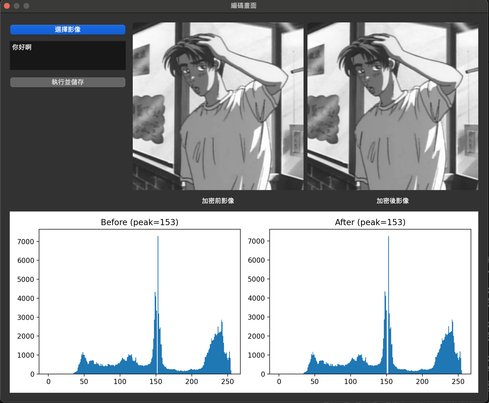
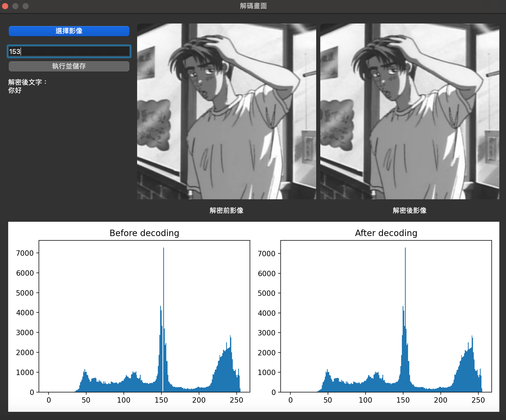

圖像資訊隱藏系統 - Histogram Shifting
這是一個使用 PyQt6 開發的圖形化桌面應用程式，能夠將文字資訊隱藏於灰階圖像中，並可進行解碼還原。其核心技術為 直方圖位移（Histogram Shifting） 的可逆資訊隱藏演算法。

# 功能特色
文字加密：將輸入的文字轉換為二進位，嵌入在指定灰階png中。
圖像顯示：即時顯示原圖與加密後圖像。
直方圖視覺化：透過 Matplotlib 呈現嵌入前後圖像的灰階分布變化。
文字解碼：可輸入 peak 值，從加密圖像中還原原始加密文字。
加密圖儲存：可以選擇自己要的資料夾來放加解密結果。

# 系統需求
Python 3.8+
PyQt6
Pillow
Matplotlib
NumPy

# 使用方法
!!! 注意圖片請使用.PNG !!!
執行main.py然後可以選開啟編碼畫面或是解碼畫面

# 編碼畫面
1. 選擇要加密的影像  
2. 輸入你要藏的文字  
3. 執行並儲存加密後的 PNG  
4. 右邊顯示加密前灰階圖與加密後的，下面顯示加密前後的直方圖  
5. **記住直方圖上的 peak value（解密時需要）**

# 解碼畫面

1. 選擇要解密的影像  
2. 輸入解密影像的 peak 值  
3. 執行並儲存解密後的 PNG  
4. 左邊會顯示解密後的文字  
5. 右邊顯示解密前灰階圖與解密後的，下面顯示解密前後的直方圖  

# 加密原理
經典可逆式資訊隱藏法Classical Reversible Data Hiding
以直方圖位移技術為基礎之可逆式資訊隱藏方法
